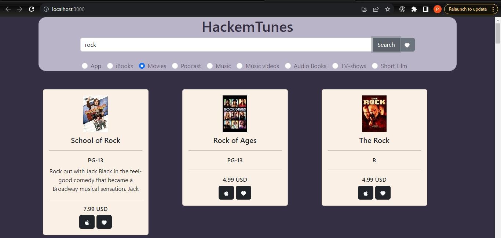

**Description**

Welcome to MediaScout.

This application uses the iTunes Web API and aims to provided a well filtered search on any type
of media that you may want to find. Media types include:
    - Apps
    - EBooks
    - Movies
    - Podcasts
    - Music
    - Music videos
    - Audio Books
    - TV-shows
    - Short Films

Also including the feature of storing your favorite media.

For security the express backend makes use of the helmet library. Other libraries used to
make this application possible are:
    - body-parser
    - chai
    - concurrently
    - express
    - helmet
    - mocha
    - node-fetch
    - bootstrap
    - mocha
    - react
    - react-dom
    - react-icons
    - react-redux
    - react-router-dom
    - react-scripts
    - react-test-renderer

**Installation**

- This project requires node and npm
- Open CLI and navigate to project directory
- Run "npm install" to install all dependencies
- Navigate to "/frontend"
- Again run npm install
- navigate back the project directory
- While in project directory run "npm run dev" to start application

**Use**

- In the search bar select a media category to search in iTunes
- Type a key word in the search bar and click search
- Search items should display
- use to Apple Logo button on each item to navigate to their respective iTunes page
- use the Heart button to add this item to a list of favorites
- select the Heart button next to the search button to navigate to the page containing all your favorites
- On the favorites page, you can view and delete any of the items listed in your favorites library

**Testing**

Backend:
    - Navigate to the project directory in the CLI
    - type "npm run test" to run backend tests

Frontend
    - Navigate to "/frontend"
    - type "npm run test" to run frontend tests